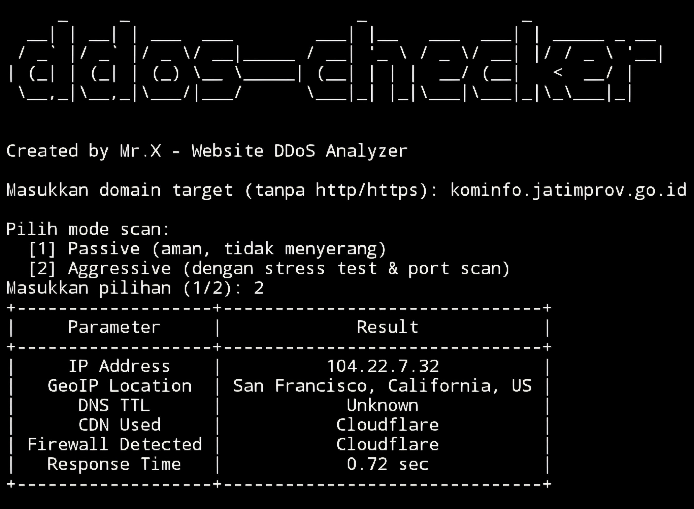

7-12
# ddos-checker


## introduction
ddos-checker is a tool used to perform a test on a website from a DDOS attack to find security gaps in a website.

## Instalations
```
$ pkg update -y && pkg upgrade -y
$ apt update -y && apt upgrade -y
$ pkg install git
$ pkg install python -y
$ git clone https://github.com/Whomrx666/ddos-checker.git
$ cd ddos-checker
$ pip install -r requirements.txt
$ python3 ddos-checker.py
```

## Instructions
- **first**: Install tools according to the instructions above.
- **second**: Enter the domain you are targeting without http/https.
- **third**: Select one of the scan modes that you want to use.
- **last**: The tool will automatically check the website to see if there are any loopholes for performing DDOS or if it is safe enough.

## Feature
- **Passive mode:** Conducting checks safely without carrying out any attacks and explaining website security information quickly, concisely and clearly.
- **Aggressive mode:** Perform a complete check starting from SSL then checking all open ports, performing a short stress test attack,check the rate limit, see the resilience of website resources,perform scoring and mitigation assessments,and final analysis.


## Observation
This is a tool for education only, I am not responsible for any misuse
### Original Author
<a href="https://github.com/Whomrx666"></a>

### <<< If you copy , Then Give me The Credits >>>

## CONNECT WITH ME :

[](https://whomrxhackers.blogspot.com/)
[](https://twitter.com/whomrx666)
[](https://youtube.com/@whomrxhackers)
[](https://facebook.com/https://www.facebook.com/whomrx.666)
[](https://t.me/@Whomr_X)
[](mailto:whomrx666@gmail.com)
[](https://www.tiktok.com/@whomr.x)

**If you want to donate, click on the button**
<a href="https://saweria.co/whomrx"></a>

### Visitors :

